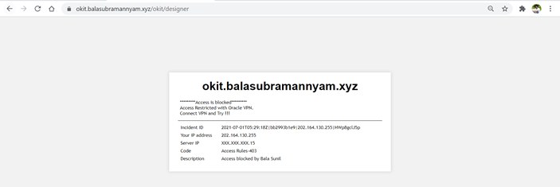

# OCI Web Application Firewall WAF Setup
The document explain you How to setup OCI Web Application Firewall (WAF) with few use cases.

## Introduction about OCI WAF
Oracle Cloud Infrastructure Web Application Firewall (WAF) is a cloud-based, Payment Card Industry (PCI) compliant, global security service that protects applications from malicious and unwanted internet traffic. WAF can protect any internet facing endpoint, providing consistent rule enforcement across a customer's applications. The Oracle Cloud Infrastructure WAF is based on Oracle Zenedge. 

Zenedge is a leading, global provider of cloud-based, artificial intelligence-driven cybersecurity solutions. Zenedge solutions are powered by proprietary artificial intelligence (AI) technology, inspecting web traffic in real-time, identifying threats and behavior anomalies and dynamically updating security postures accordingly. On February 15, 2018, Oracle announced that it signed an agreement to acquire Zenedge, adding leading cloud-based network and infrastructure security capabilities to protect enterprises from today's complex digital threats.

-----------------------------------------------------------------------------------------------------------------------------------------------------------------------------------------------------------------------------------------------------------------------------------------------------------------------------------------------------------------------------------------------------------------------------------------------------------------------------------------------------------------------------------------------------------------------------
##
## 
## Here are the key capabilities of OCI WAF
1. **Protection Rules**
1. **Access Control**
1. **Threat Intelligence**
1. **Bot Management**
### **We will explore the abilities and OCI WAF with the following setup.**

#### The above architecture is a very basic one which I'm going to demonstrate through the WAF setup.
### The following are the pre-requisites which need to be setup the OCI WAF
1. A public Domain and DNS, Here I used my domain "www.balasubramannyam.xyz". 
1. A Public Endpoint running the WEB Application. Here I'm using a simple web page to demonstrate the use cases. The website is hosted on top of Oracle Linux Instance in a private subnet and the traffic is forwarding to the backend via a Public Load Balancer.
1. SSL certificated for the Domain ([www.balasubramannyam.xyz).](http://www.balasubramannyam.xyz\).) In this case I have a wildcard SSL for my domain which procured from Letsencrypt.

Here is a glimpse to the load balancer setup.

Total of three backend sets.

1. Webserver
1. OKIT (_Oracle Designer ToolKit. Its just a web based application. included here for demontration purpose_)
1. SSH

Hostnames & Listeners

 

###  
#####  
###  
### Test Cases:
### 1.Load the website "[balasubramannyam.xyz](https://balasubramannyam.xyz)" via WAF
### 2.Restrict the access to OKIT which installed in the server with Oracle India VPN. OKIT URL is [https://okit.balasubramannyam.xyz](https://okit.balasubramannyam.xyz/)
### 3.Block the traffic to the the url [https://balasubramannyam.xyz/oci](https://okit.balasubramannyam.xyz/oci)
### 4.Redirect the the traffic from the url <https://balasubramannyam.xyz/bala> to the homepage [https://www.balasubramannyam.xyz/](https://www.balasubramannyam.xyz/)
### 5.Enable captcha to the webpage [https://www.balasubramannyam.xyz/captcha](https://www.balasubramannyam.xyz/captcha)
### 6.Enable log and allow the access based on location
### 7.Enable recommended Protection Rules by OCI WAF

### Step 1 – Uploading the WAF certificate under "Menu → Identity & Security → Certificates"

### **Step 2 – Creating the WAF policies "Menu → Identity & Security → policies "**
Enter the primary domain and the additional domain need to configure with WAF

Assign the origin as the public endpoint of the application. You can give IPv4 or FQDN of the application. Here I'm giving the Load balancer IP of my web application. 

Yeah !!! Now you are successfully created a WAF.
### Step 2 – Point the WAF to your Domain
This is the important step to setup the WAF, which means pointing your domain to OCI WAF. After successful provisioning of WAF, you can find the CNAME target details in the information tab. Update the same in your public Domain DNS to point the request to Oracle WAF.

## Adding CNAME entry in to the public DNS.
In this case, I'm have my domain with <https://in.godaddy.com/> . I have updated the CNAME in godady DNS

Now the time to verify whether WAF is serving my webpage ?

For that just load the website and inspect the web page network tab to confirm the connection is going via the OCI WAF

1.     Open a web browser (this example is using Google Chrome).

2.     Enter the web address of your domain name ([www.balasubramannyam.xyz](http://www.balasubramannyam.xyz)).

3.     When the website is displayed, right-click and select **Inspect**.

4.     Click the **Network** tab.

5.     Click CTRL+R.

6.     In the **Name** column, select [www.balasubramannyam.xyz](http://www.balasubramannyam.xyz)

7.     Click the **Headers** tab. The **Server** field should display **ZENEDGE**. This indicates that your website is being inspected by Oracle Cloud Infrastructure WAF.

# **Yah !!! Now the WAF is successfully setup for your domain !!!!**
So now we have tested the first use case mention in the top of this article. 
# Test Case 2: Restrict the access to OKIT which installed in the server with Oracle India VPN. OKIT URL is [https://okit.balasubramannyam.xyz](https://okit.balasubramannyam.xyz/)
Add oracle India VPN IP ranges to the WAF. Click Menu → Identity & Security → IP Address Lists

To achieve the above use case, navigate to the WAF policy, Menu → Identity & Security → policies  select **Access Control**

1.     Click **Add Access Rule**.

2.     Enter a unique name for the access rule

3. Under **action** select **Block**
4. Select block action "**Show Error Page**"

5.     Under **Conditions**, select **Country/Region is** from the **Rule Conditions** menu.

6.     From the IP **Address in not in the address List** menu, select **Address List**

7.     Click **Additional Condition**.

8.     From the **Rule Conditions** menu, select url **start with**. enter the url as "/okit"

9. Then **Save Changes** 

10.  Under **Unpublished Changes** , click **Publish all**

Verify once the changes published

Accessing the webpage [https://okit.balasubramannyam.xyz](https://okit.balasubramannyam.xyz/) without VPN

Connect to oracle VPN 

Then access [https://okit.balasubramannyam.xyz](https://okit.balasubramannyam.xyz/) (with VPN)

# Test Case 3: Block the traffic to the the url [https://okit.balasubramannyam.xyz/oci](https://okit.balasubramannyam.xyz/oci)

Here is the access control rule for the above test case 

Test the output

# Test Case 4: Redirect the the traffic from the url <https://balasubramannyam.xyz/bala> to the homepage [https://www.balasubramannyam.xyz/](https://www.balasubramannyam.xyz/)

Once you publish the above changes, when you access the url <https://balasubramannyam.xyz/bala> it will redirect to <https://www.balasubramannyam.xyz/>
# Test Case 5: Enable captcha to the webpage [https://www.balasubramannyam.xyz/captcha](https://www.balasubramannyam.xyz/captcha)
WAF policy, Menu → Identity & Security → policies  select **Bot Management** 

1.     Click **CAPTCHA Challenge** tab

2.     Add CAPTCHA Challenge

3. update the url path
4. Fill up the appropriate message

5.     Click Add.

6. Under **Unpublished Changes** , click **Publish all**

Once  publish the changes, access the url <https://www.balasubramannyam.xyz/captcha>

# Test case 6: Enable log and allow the access based on location

I have enabled logging from the request coming from India Region.

Refer the outputs under the logs 

# Test case 7: Enable recommended Protection Rules by OCI WAF

WAF policy, Menu → Identity & Security → policies  select **Protection Rules**

1.     Click **Recommendations** tab

2.     Enable the recommended rules (The suggestion detected as per your web contents, understand the same and check with your developer before applying it to the WAF policy, Sometime it will affect the application functionality).

3. Navigate to the **Rule Settings** to update error code or error page
4. Edit with the appropriate message

5.     Click save changes

6. Under **Unpublished Changes** , click **Publish all**

#### **So that's it from my side. I hope you got an idea or an overview about OCI WAF and how effectively you can use WAF in your projects.
#### I have not mentioned all of the functionalities of WAF like Caching Rules and Java Script challenge due to the limitations with my test setup. But, yes I tried my best to showcase the WAF concepts.**
-------------------------------------------------------------------------------------------------------------------------------------------------------------------------------------------------------
##
### ***If you have any doubts or clarification, Feel free to contact me anytime, I'm open for that always !!! Suggestions and feedbacks are welcome*** 
### ***Cheers ***

####### Thanks you 

Bala Sunil
balasubramannyam.sunil@oracle.com

